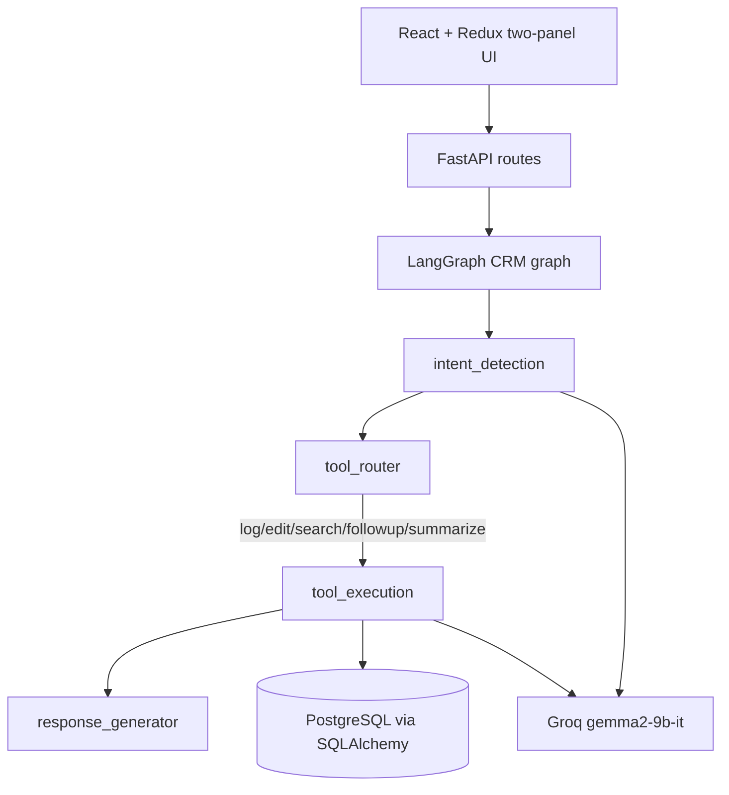

# AI-First CRM HCP Module

## Project Overview

AI-first CRM workflow for healthcare professional field interactions. The app supports structured logging and conversational CRM actions for reps who need to record meetings, edit existing entries, review HCP history, schedule follow-ups, and generate CRM-ready summaries.

## Architecture Diagram



## Tech Stack

React, Redux Toolkit, FastAPI, SQLAlchemy, LangGraph, Groq, PostgreSQL.

The backend defaults to SQLite for local smoke tests when `DB_URL` is not set. Use PostgreSQL for the final assignment demo.

## LangGraph Flow

`intent_detection` classifies the user message into `log`, `edit`, `search`, `followup`, or `summarize` using `gemma2-9b-it`.

`tool_router` validates the action and drives the conditional edge.

`tool_execution` calls the matching CRM tool and writes the result into state.

`response_generator` converts tool output into a user-facing CRM assistant reply.

## 5 Tools Description

`log_interaction_tool` extracts entities from free text, creates or reuses the HCP, stores the interaction, and returns the new interaction ID plus extracted JSON.

`edit_interaction_tool` updates valid fields on an existing interaction after extracting the interaction ID and update payload.

`search_hcp_tool` performs partial HCP lookup and returns all interaction history sorted by most recent activity.

`followup_scheduler_tool` reviews recent HCP interactions, asks the LLM for a follow-up recommendation, stores a follow-up record, and returns the scheduled date and note.

`interaction_summarizer_tool` summarizes a single interaction, an HCP history, or recent CRM activity into a concise CRM report paragraph.

## Setup Instructions

1. Create environment files:

```bash
cp backend/.env.example backend/.env
cp frontend/.env.example frontend/.env
```

2. Install backend dependencies:

```bash
python -m venv .venv
source .venv/bin/activate
pip install -r requirements.txt
```

3. Start the backend:

```bash
uvicorn backend.main:app --reload --port 8000
```

4. Install and start the frontend:

```bash
cd frontend
npm install
npm start
```

5. Open `http://localhost:3000`.

## API Routes

`GET  /api/interactions` - list recent interactions (default 50, max 200 via `?limit=`).

`POST /api/interactions` - log a structured interaction.

`GET  /api/interactions/{id}` - retrieve one interaction.

`PUT  /api/interactions/{id}` - edit an interaction.

`GET  /api/hcp` - list / search HCPs by name (`?q=` for autocomplete).

`GET  /api/hcp/{id}/interactions` - retrieve full HCP interaction history.

`POST /api/agent/chat` - run the LangGraph CRM assistant.

`POST /api/agent/extract` - extract CRM entities from free text.

`GET  /api/followups` - list scheduled follow-ups.

`GET  /api/health` - service health and active LLM model.

## Environment Variables

`GROQ_API_KEY` - Groq API key.

`GROQ_MODEL` - must be `gemma2-9b-it` for the assignment.

`DB_URL` - PostgreSQL connection string.

`REACT_APP_API_URL` - frontend API base URL.

## Future Improvements

Add HCP autocomplete search, richer form validation, auth roles, automated Playwright coverage, and a dashboard view for follow-up workload.

> Code generated using ChatGPT 5.0 as per assignment guidelines.

> LLM model: gemma2-9b-it via Groq API.
